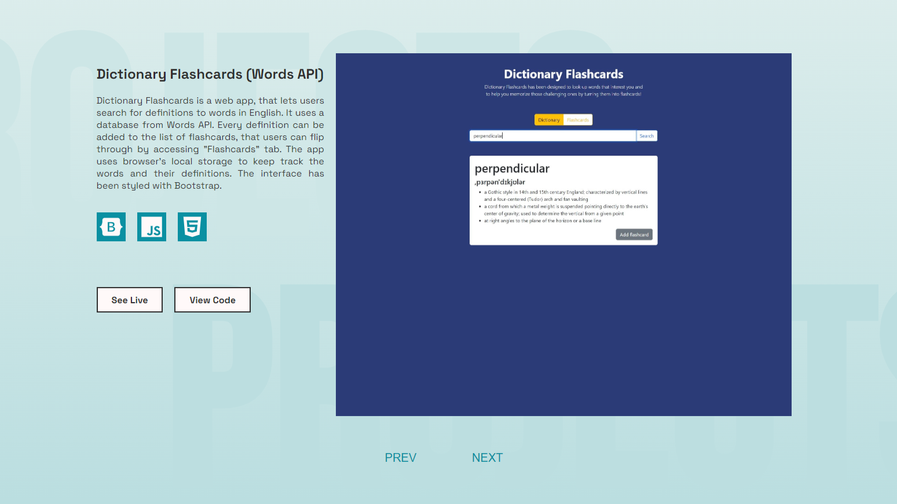

## React Portfolio Website

Every developer needs a place where they can showcase their work. This project is exactly that. It is a fully responsive React website in a landing page format. It consists of 5 sections: hero section, projects, skills, about and contact. It uses React's state hook to handle the functionality of the projects gallery and the hamburger menu in a mobile view. This project was an opportunity for me to polish my React skills and solidify what I had already known about the library.

Technologies used:
* React
* JavaScript
* HTML/CSS

You can visit the website here - [damianw.dev](https://damianw.dev/).

## Desktop view

## Mobile view

